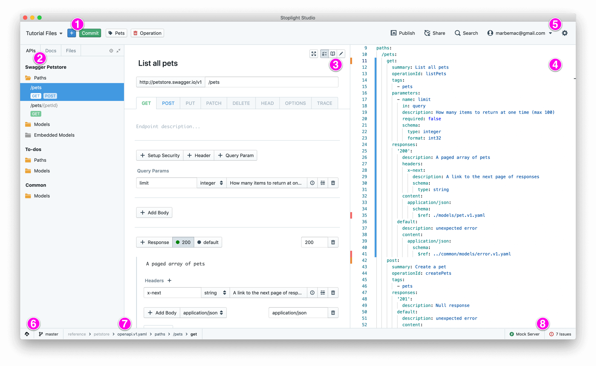

# UI Overview

1. **Project Actions:** Contains actions to help you add new assets to your project, such as APIs, models, articles, etc.
2. **Project Trees:** The project sidebar tree tabs provide different views into your project. Switch between a view of API related assets, docs, and all of the files/folders in your project.
3. **Primary Panel:** You can switch which mode is shown on the primary panel by clicking the mode selector in the top right. You can show the form editor, docs view, or code editor here. You can also click the expand button to go full screen with the panel.
4. **Secondary Panel:** The secondary panel allows you to view two different modes side by side. In this screenshot, we've configured Studio to show the form editor in the primary panel, and the code editor in the secondary panel.
5. **Settings & Login:** Most of Studio can be used offline & while logged out. A few features, such as git, require you to login.
6. **Git:** If the project you are working with is connected to a Git repository, you can quickly switch branches by clicking on these buttons.
7. **Crumbs:** These crumbs give you an at a glance look at where you are in your project.
8. **Spectral & Prism:** Click these buttons to open the validations and mocking panels.